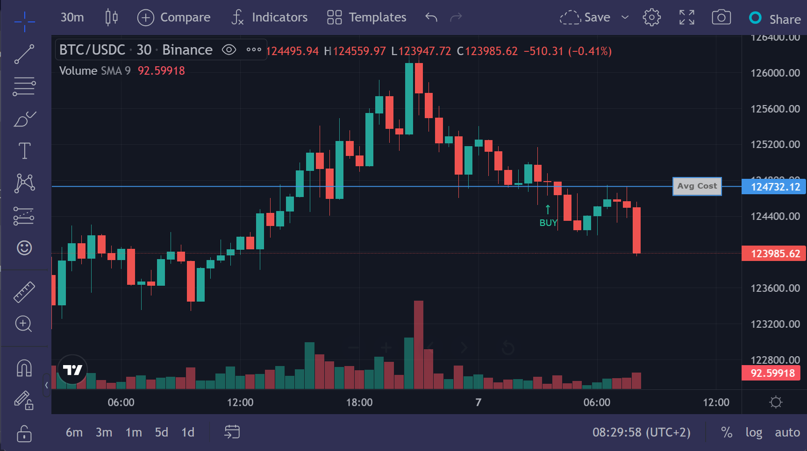
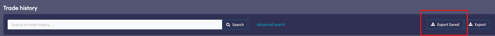

# Cryptohopper Scripts

A collection of userscripts to enhance the Cryptohopper trading platform experience.

## What Is Cryptohopper?

Cryptohopper is a sophisticated algorithmic trading platform that connects directly to your cryptocurrency exchange, executing trades autonomously based on technical analysis, market signals, and custom strategies. Operating continuously, it monitors market conditions and makes data-driven decisions about entry points and exit targets to optimize trading performance.

[Sign Up for Cryptohopper](https://www.cryptohopper.com/?atid=37888) (affiliate link)

## Why These Scripts?

Cryptohopper delivers robust, consistent results through its automated trading approach. However, the platform's interface can be tailored to better support disciplined, data-driven decision-making.

These userscripts represent practical modifications built on the work of various community contributors (credited in each script). Originally developed for personal use to address specific workflow needs, they proved valuable enough to share with the broader trading community.

## ⚠️ Security Implications

These scripts manipulate elements on a financial site while you are logged in. Please read and understand what the code is doing before you run it.

You are responsible for the code you run on your computer. By downloading and executing these scripts, you take responsibility for anything they may do, so please read and understand the code **before** installing it.
Cryptohopper may change its website at any moment, causing one or all of these scripts to cease functioning.

## 📋 Script List

| Script | Version | Description | Page |
|--------|---------|-------------|------|
| [Absolute Values](01.%20Absolute%20Values.user.js) | 1.2 | Adds absolute profit/loss values to open positions | Dashboard |
| [Latest Sells Absolute Values](02.%20Latest%20Sells%20Absolute%20Values.user.js) | 1.1 | Adds absolute profit/loss to latest sells widget | Dashboard |
| [Trade History Absolute Values](03.%20Trade%20History%20Absolute%20Values.user.js) | 1.1 | Adds absolute profit/loss to trade history | Trade History |
| [Stats Detail](04.%20Stats%20Detail.user.js) | 1.0 | Enhanced profit breakdown and base currency info | Dashboard |
| [Position Targets](05.%20Position%20Targets.user.js) | 1.1 | Adds visual indicators for buy/sell targets | Dashboard |
| [Panic Button Remover](06.%20Panic%20Button%20Remover.user.js) | 1.1 | Hides the panic button from dashboard | Dashboard |
| [Target Restore](07.%20Target%20Restore.user.js) | 1.1 | Shows active and inactive trading targets | Dashboard |
| [TradingView Chart Mods](08.%20TradingView%20Chart%20Mods.user.js) | 1.0 | Adds buy indicators and position lines to charts | Charts |
| [Chat Assistant Removal](09.%20Chat%20Assistant%20Removal.user.js) | 0.5 | Removes Hoppie mascot and Intercom widget | All Pages |
| [Export Saved Trade History](10.%20Export%20Saved%20Trade%20History.user.js) | 1.0 | One-click export with saved settings | Trade History |
| [AI Bulk Training](11.%20AI%20Bulk%20Training.user.js) | 1.0 | Bulk train AI strategies with multiple pairs | AI Strategies |
| [Coin List Exporter](12.%20Coin%20List%20Exporter.user.js) | 1.0 | Export coin list to clipboard | Config |

## 🚀 Installation

HOW TO VIIDEO:
[![Watch the HOW-TO video]](https://youtu.be/M10Y1doGnC0)

### Prerequisites
- Install a userscript manager:
  - **Chrome/Edge**: [Tampermonkey](https://chrome.google.com/webstore/detail/tampermonkey/dhdgffkkebhmkfjojejmpbldmpobfkfo)
  - **Firefox**: [Tampermonkey](https://addons.mozilla.org/en-US/firefox/addon/tampermonkey/) or [Greasemonkey](https://addons.mozilla.org/en-US/firefox/addon/greasemonkey/)
  - **Safari**: [Tampermonkey](https://apps.apple.com/app/tampermonkey/id1482490089)
  - **Opera**: [Tampermonkey](https://addons.opera.com/en/extensions/details/tampermonkey-beta/)

### Installing Scripts
1. Click on the script file you want to install from the table above
2. Click the "Raw" button on GitHub
3. Your userscript manager will prompt you to install
4. Click "Install" to confirm

### Automatic Updates
Scripts with `@updateURL` tags support automatic updates via your userscript manager.

## 📖 Script Details

### Dashboard Scripts

#### 01. Absolute Values
Displays absolute profit/loss amounts next to percentage values in open positions table.

____________________________

#### 02. Latest Sells Absolute Values
Adds absolute profit/loss calculations to the "Latest 5 Sells" widget.

____________________________

#### 03. Trade History Absolute Values
Adds absolute profit/loss values to all sell transactions in the trade history table.

____________________________

#### 04. Stats Detail
Enhanced stats box showing:
- Gross profit breakdown
- Base currency available

____________________________

#### 05. Position Targets
Adds colored icons after coin names:
- 🟢 Green: Buy target active
- 🔴 Red: Sell target active

____________________________

#### 06. Panic Button Remover
Removes the panic button widget to prevent emotional trading decisions.

____________________________

#### 07. Target Restore
Restores the old target display functionality, showing both active (green) and inactive (yellow) targets.

____________________________

#### 08. TradingView Chart Mods
Enhances TradingView charts with:
- Buy indicator at entry point
- Average cost position line

____________________________

#### 09. Chat Assistant Removal
Removes chat assistant widget

____________________________

#### 10. Export Saved Trade History
Adds three buttons to export dialog:
- **Save Settings**: Save export configuration
- **Load Settings**: Load saved configuration
- **Export Saved**: One-click export with saved settings (only works if previously saved settings)

____________________________

#### 11. AI Bulk Training
Adds "Bulk Learn" button to train multiple coin pairs simultaneously. Prevents duplicate training and respects queue limits.
**Usage:**

1. Navigate to the AI training page
2. Select your exchange
3. You will see a new button called "Bulk Learn" - clicking this will open the dialog

4. Enter a comma-separated list of the coin pairs you want to train

5. Click OK and watch it go!

____________________________

#### 12. Coin List Exporter
Adds "Copy coinlist" option to config dropdown menu. Exports coins in `COIN/BASE` format (e.g., `BTC/USDC, ETH/USDC`).

____________________________

## 🔧 Compatibility

- **Platform**: Cryptohopper.com
- **Browsers**: Chrome, Firefox, Edge, Safari, Opera
- **Userscript Managers**: Tampermonkey, Greasemonkey, Violentmonkey
- **Last Tested**: October 2025

## 🤝 Contributing

Contributions are welcome! Please:
1. Test your changes thoroughly
2. Follow the existing code style
3. Update version numbers appropriately
4. Document any new features in this README

## 💝 Support

If you find these scripts useful and want to support continued development, consider buying me a coffee or a beer:

  
  

  <em>Donations are appreciated but never required. These scripts will always remain free and open source.</em>

## 📝 Credits

Original authors and contributors:
- @eatsleepcoderepeat-gl
- @markrickert
- @henrygarle
- @falcontx
- coffeeneer

Maintained and enhanced by @ilcesko

## ⚠️ Disclaimer

These scripts are provided as-is. Use at your own risk. Always verify calculations and double-check before executing trades. The authors are not responsible for any trading losses.

## 📄 License

MIT License - see [LICENSE](LICENSE) file for details
